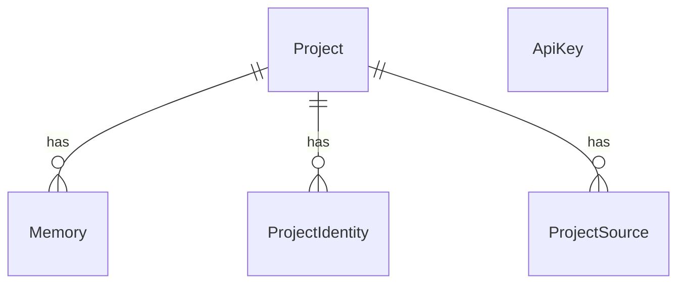
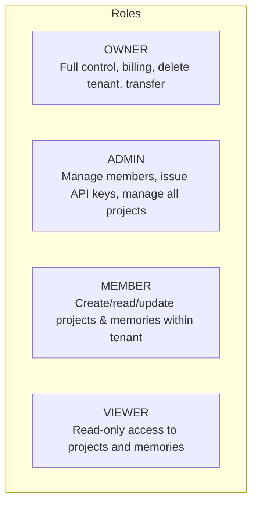

# AiMemorySync — Authentication & Tenant Architecture Audit & Specification

> **Status**: APPROVED ARCHITECTURE & IMPLEMENTED DATABASE FOUNDATION (Phase 6B.1 Completed)  
> **Date**: 2026-09-11  
> **Scope**: Multi-Tenant Hierarchy, Human Sessions vs Machine API Keys, Safe Database Migration, Backward Compatibility  
> **Prerequisites**: Codebase Audit of `prisma/schema.prisma`, `src/app/login/`, `src/app/api/`, `src/lib/`, `packages/client-core/`, `packages/mcp-server/`

---

## Executive Summary

An architectural audit of **AiMemorySync** was conducted following the observation that the web application login (`http://localhost:3000/login`) prompts human users for a raw Bearer secret token (`aimem_live_*`) stored in browser `localStorage`. 

This audit confirms that:
1. **The current database contains NO `User` model, NO `Tenant` model, NO `Workspace` model, and NO `Session` model.**
2. **The current login flow uses machine integration credentials as human login tokens**, causing critical usability and security problems.
3. **The current database has ZERO tenant isolation.** All projects, identities, sources, memories, and API keys reside in a single flat global namespace. Any valid API key with `read` or `write` scopes can query, modify, or delete all projects and memories across the entire database.
4. **API keys are machine credentials** (for Cursor, Antigravity, VS Code, MCP servers, and CLI runners). They must **never** be the primary credential for human web access.

This document establishes the comprehensive target architecture, data models, migration strategy, security threat model, and phased roadmap to transform AiMemorySync into a true **tenant-first SaaS platform**.

---

## 1. Current Architecture

### 1.1 Existing Database Schema (`prisma/schema.prisma`)
The current database contains exactly five models:



1. **`Project`**:
   - Fields: `id`, `name`, `slug` (`@unique`), `description`, `status`, `creationSource`, `createdAt`, `updatedAt`.
   - **Flaw**: `slug` is globally unique across the entire database. There is no `tenantId` or `ownerId`.
2. **`ProjectIdentity`**:
   - Fields: `id`, `projectId`, `type`, `value`, `identityHash`, `isPrimary`, `confidence`, `createdAt`, `updatedAt`.
   - Bounded to `Project`.
3. **`ProjectSource`**:
   - Fields: `id`, `projectId`, `platform`, `externalId`, `localPathDigest`, `metadata`, `lastSeenAt`, `createdAt`.
   - Bounded to `Project`.
4. **`Memory`**:
   - Fields: `id`, `projectId`, `type`, `title`, `content`, `priority`, `contentHash`, `status`, `createdAt`, `updatedAt`.
   - Bounded to `Project`.
5. **`ApiKey`**:
   - Fields: `id`, `name`, `keyHash` (`@unique`), `prefix`, `last4`, `scopes` (`String[]`), `createdAt`, `updatedAt`, `lastUsedAt`, `expiresAt`, `revokedAt`.
   - **Flaw**: Standalone entity completely unattached to any tenant, user, or project.

### 1.2 Existing Authentication Mechanism
- **Tokens**: Plaintext Bearer tokens formatted as `aimem_<live|test>_<24_bytes_base64url>` (e.g., `aimem_live_...`).
- **Database Storage**: Only the cryptographic SHA-256 hash (`keyHash`) is persisted in `api_keys`.
- **API Guard (`src/lib/api/auth-guard.ts`)**:
  - Validates `Authorization: Bearer <token>` or `x-api-key`.
  - Searches `api_keys` where `keyHash == SHA-256(token)`.
  - Checks if revoked or expired, checks scopes (`read`, `write`, `admin`).
  - Returns `AuthPrincipal: { keyId, name, scopes }`.
  - Has a development-only bypass if `ALLOW_DEV_ANONYMOUS_AUTH=true`.
- **Route Handlers**:
  - `GET /api/projects` calls `listProjects()` with NO tenant filter.
  - `POST /api/projects` calls `createProject()` with NO tenant assignment.
  - `GET /api/projects/:id/memories` fetches memories solely by `projectId`.
  - Any caller holding any active API key with `read` scope can retrieve every project and memory in the database.

---

## 2. Current Login Problem

### 2.1 The Current Web Login Flow
At `src/app/login/page.tsx`:
1. The page prompts the human user: *"Sign In with API Token: Authenticate your session using your project Bearer secret token (`aimem_live_...`)"*.
2. Upon submitting, the browser issues `GET /api/auth/verify` with `Authorization: Bearer <key>`.
3. If valid, the raw plaintext key is stored directly in the browser's `localStorage` via `setApiKey(cleanKey)` (`src/lib/api-client.ts`).
4. Subsequent web app requests read `localStorage.getItem("aimemory_api_key")` and attach it as a Bearer token.

### 2.2 Why This Is Unsuitable for Human Web Login

| Dimension | Machine API Key (Current) | Human Web Session (Target) |
| :--- | :--- | :--- |
| **Credential Type** | High-entropy secret token (`aimem_live_...`) | Email + Password (or SSO / Passkey) |
| **Human Usability** | Impossible for humans to memorize; requires copy/paste | Standard memorable credentials |
| **Bootstrapping Paradox** | How does a user log in to create an API key if login requires an API key? | User registers with email/password to create their initial workspace |
| **Client Storage** | `localStorage` (Vulnerable to XSS theft) | `HttpOnly`, `Secure`, `SameSite=Lax` Cookies |
| **Session Lifecycle** | Typically long-lived (months/years) or static | Sliding session window (e.g. 14-30 days), revocable on password reset |
| **Identity & Auditing** | Represents a tool/process (e.g. "Cursor IDE") | Represents a specific human actor (e.g. "Jane Doe <jane@acme.com>") |
| **Scope of Authority** | Scoped to a specific tenant/project with least privilege | Bound to the human's organizational memberships and role |

---

## 3. Tenant Architecture Gap

### 3.1 What Is Missing
The current codebase lacks all foundational concepts of multi-tenancy:
1. **No Organization / Tenant Entity**: There is no table representing a customer company, team, or workspace.
2. **No User Entity**: There is no table representing human accounts.
3. **No Membership / Association Entity**: There is no mapping of which humans belong to which workspaces or what roles they possess.
4. **Global Namespace Collision**: `Project.slug` is `@unique` across the entire database. If Tenant A creates a project named `"backend"`, Tenant B cannot create a project named `"backend"`.
5. **No Data Boundary Enforcement**: Database queries have no tenant filter (`where: { tenantId }`), meaning zero data isolation.

### 3.2 Target Resource Hierarchy

```
User (Human)
 └── Memberships (TenantMember: OWNER | ADMIN | MEMBER | VIEWER)
      └── Tenant (Company / Team Workspace)
           ├── Projects
           │    ├── ProjectIdentities (Git Remote, Manifest, Digest)
           │    ├── ProjectSources (Platform sessions, IDE paths)
           │    └── Memories (Decisions, Requirements, Conventions, Bug Solutions)
           ├── Integrations (Antigravity, Cursor, VS Code, Slack, GitHub)
           └── Machine API Keys (Scoped to Tenant + optional Project)
```

---

## 4. Human Authentication Architecture

### 4.1 Target Flow
1. **Registration (`/signup`)**:
   - Human inputs: `Full Name`, `Work Email`, `Password`, `Workspace Name`.
   - Server creates:
     - `User` record (with salted `passwordHash`).
     - Default `Tenant` record (e.g., "Acme Corp").
     - `TenantMember` record with role `OWNER`.
     - `Session` record in database.
   - Server returns response with `Set-Cookie: aimem_session=<sessionToken>; HttpOnly; Secure; SameSite=Lax; Path=/`.
2. **Login (`/login`)**:
   - Human inputs: `Email` and `Password`.
   - Server looks up `User` by normalized email, verifies password using a constant-time hashing algorithm (Argon2id or bcrypt).
   - Server creates a new `Session` record linked to `userId` and the user's default `tenantId`.
   - Server sets the secure `HttpOnly` cookie.
3. **Authenticated Web Navigation**:
   - On every request, Next.js middleware / route handlers inspect the `aimem_session` cookie.
   - The session token is validated against the database (or verified via encrypted signed token), resolving:
     - `User` profile.
     - Active `Tenant`.
     - `Role` within the active Tenant.

### 4.2 Security Standards for Human Auth
- **No Passwords in Plaintext**: Salted hashing via `argon2` or `bcrypt` (work factor >= 12).
- **No Tokens in LocalStorage**: Zero sensitive human tokens stored in browser `localStorage`.
- **HttpOnly Cookies**: Inaccessible to JavaScript, completely mitigating XSS token extraction.
- **CSRF Protection**: `SameSite=Lax` cookie policy combined with Next.js header verification on mutating requests.

---

## 5. Machine Authentication Architecture

### 5.1 Machine Integrations
The machine integrations in AiMemorySync include:
- **Cursor IDE** (Composer, Agent, Background MCP)
- **Antigravity IDE** (AI Coding Agent MCP)
- **VS Code Extension** (Dedicated sidebar and background client)
- **Universal MCP Server** (`@aimemory/mcp-server`)
- **CLI Tools & CI/CD Agents**

### 5.2 Machine Credential Flow
1. A human administrator logs into the web dashboard, navigates to **Workspace Settings &rarr; API Keys**, and clicks **"Create Machine Key"**.
2. The user specifies:
   - Key Name (e.g., "Jane's Cursor IDE on MacBook").
   - Target Scope: **Tenant-wide** OR restricted to a **Specific Project** (e.g., "AiMemorySync Monorepo").
   - Permissions: `["read", "write"]`.
3. The server generates a high-entropy secret (`aimem_live_...`), stores its SHA-256 hash in `api_keys` with foreign keys to `tenantId` and optional `projectId`.
4. The user copies the key and configures it in their local IDE / MCP settings.
5. All requests from the IDE send `Authorization: Bearer aimem_live_...`.
6. The backend validates the key hash, immediately associates the request with the specific `tenantId` and `projectId`, and enforces strict tenant/project boundary checks.

---

## 6. Tenant Membership Model

### 6.1 Multi-Tenant Relations
- **One User &rarr; Multiple Tenants**: A developer can belong to their personal workspace, their company's workspace, and an open-source client workspace.
- **One Tenant &rarr; Multiple Users**: An engineering team has multiple developers, leads, and administrators.

### 6.2 Role-Based Access Control (RBAC)



| Permission | OWNER | ADMIN | MEMBER | VIEWER | Machine Key (`read/write`) |
| :--- | :---: | :---: | :---: | :---: | :---: |
| Read Projects & Memories | Yes | Yes | Yes | Yes | Yes (if scoped) |
| Create/Edit Memories | Yes | Yes | Yes | No | Yes (if scoped) |
| Create/Edit Projects | Yes | Yes | Yes | No | Yes (if tenant-wide) |
| Delete Projects/Memories | Yes | Yes | No | No | No (Admin only) |
| Manage Tenant Members | Yes | Yes | No | No | No |
| Issue/Revoke API Keys | Yes | Yes | No | No | No |
| Delete Tenant / Billing | Yes | No | No | No | No |

---

## 7. API Key Scoping Model

### 7.1 Enhanced `ApiKey` Attributes
Every `ApiKey` must be explicitly bounded:
1. **`tenantId` (Required)**: An API key can never operate outside its parent tenant.
2. **`projectId` (Optional)**:
   - If `null`: The API key is a **Tenant Integration Key** and can resolve/access any project belonging to that tenant.
   - If set: The API key is a **Project-Scoped Key** (e.g. dedicated to a single repo). Any attempt to access, resolve, or query another project is rejected with `403 Forbidden`.
3. **`scopes`**: Array of granular permissions (e.g. `["projects:read", "memories:read", "memories:write"]`).
4. **`createdById`**: Foreign key to the human `User` who provisioned the key for audit logging.
5. **Lifecycle**: `expiresAt`, `revokedAt`, `lastUsedAt`.

---

## 8. Authorization Model

### 8.1 Unified Auth Principal Context
Every incoming HTTP request is resolved into a strongly typed `AuthContext`:

```typescript
export type AuthContext = 
  | {
      type: "HUMAN";
      userId: string;
      tenantId: string;
      role: "OWNER" | "ADMIN" | "MEMBER" | "VIEWER";
      userEmail: string;
    }
  | {
      type: "MACHINE";
      keyId: string;
      tenantId: string;
      projectId: string | null;
      scopes: string[];
      name: string;
    };
```

### 8.2 Authorization Enforcement Points
1. **Authentication Gate**: `requireAuth(request)` resolves either the human session cookie OR the machine Bearer token.
2. **Tenant Isolation Gate**: All database queries MUST inject `tenantId: ctx.tenantId`.
3. **Project Boundary Gate**: If `ctx.type === "MACHINE"` and `ctx.projectId !== null`, the requested `projectId` must strictly match `ctx.projectId`.
4. **Action Permission Gate**: Mutation endpoints (e.g. `POST /api/projects/:id/memories`) verify write permissions (`role !== "VIEWER"` for humans, or `scopes.includes("write")` for machine keys).

---

## 9. Session Model

### 9.1 Database-Backed Sessions
For production web access, sessions are tracked via a `sessions` table:

```prisma
model Session {
  id           String    @id @default(uuid())
  sessionToken String    @unique @map("session_token") @db.VarChar(128)
  userId       String    @map("user_id")
  tenantId     String    @map("tenant_id")
  expiresAt    DateTime  @map("expires_at")
  createdAt    DateTime  @default(now()) @map("created_at")
  userAgent    String?   @map("user_agent") @db.Text
  ipAddress    String?   @map("ip_address") @db.VarChar(45)

  user         User      @relation(fields: [userId], references: [id], onDelete: Cascade)
  tenant       Tenant    @relation(fields: [tenantId], references: [id], onDelete: Cascade)

  @@index([userId])
  @@index([sessionToken])
  @@map("sessions")
}
```

### 9.2 Session Operations
- **Creation**: On successful login/signup, a random 32-byte cryptographically secure token is generated and persisted.
- **Validation**: On each web request, the cookie token is looked up in `sessions`, joining `user` and `tenant`.
- **Tenant Switching**: A user switching active workspaces calls `POST /api/auth/switch-tenant { tenantId }`, which validates their membership and updates `Session.tenantId`.
- **Revocation / Logout**: `POST /api/auth/logout` deletes the session from the database and clears the browser cookie.

---

## 10. Project Isolation

### 10.1 Schema Changes for Projects
1. Add `tenantId String` to `model Project`.
2. Replace `@unique` on `slug` with compound tenant uniqueness:
   ```prisma
   @@unique([tenantId, slug])
   ```
   This ensures that multiple tenants can have projects with identical names/slugs (e.g., "frontend", "api", "mobile") without collision.
3. Add foreign key relation from `Project` to `Tenant` with `onDelete: Cascade`.

### 10.2 Query-Level Enforcement
Every project query must include `tenantId`:
```typescript
// Finding projects
prisma.project.findMany({
  where: { tenantId: ctx.tenantId, status: "ACTIVE" }
});

// Finding a specific project
prisma.project.findFirst({
  where: { id: projectId, tenantId: ctx.tenantId }
});
```

---

## 11. Memory Isolation

### 11.1 Cross-Tenant Leakage Prevention
Memories belong to Projects via `projectId`. Because Projects are strictly partitioned by `tenantId`, memories are indirectly isolated.

To prevent IDOR (Insecure Direct Object Reference) vulnerabilities:
- Any memory query or mutation by `memoryId` MUST verify that the memory's parent project belongs to `ctx.tenantId`:
  ```typescript
  const memory = await prisma.memory.findFirst({
    where: {
      id: memoryId,
      project: { tenantId: ctx.tenantId }
    }
  });
  ```
- Cross-project context assembly (`/api/context/assemble`) must restrict candidate memory pools strictly to projects owned by `ctx.tenantId`.

---

## 12. Security Threat Model

| Threat Scenario | Vector | Mitigation in Target Architecture |
| :--- | :--- | :--- |
| **Token Theft via XSS** | Malicious script steals `localStorage` | Human sessions use `HttpOnly` cookies; inaccessible to JavaScript. |
| **Cross-Tenant IDOR** | Attacker queries `/api/projects/<uuid>` of another tenant | Tenant guard enforces `where: { id, tenantId: ctx.tenantId }`. Returns `404 Not Found`. |
| **Stolen Machine API Key** | Developer commits `.cursor/mcp.json` or `.env` | Keys can be scoped to a single project with read-only permissions; instantly revocable from dashboard. |
| **Credential Guessing / Brute Force** | Automated dictionary attacks on `/api/auth/login` | IP-based and account-based rate limiting + exponential delay. |
| **Tenant Slug Squatting** | Competitor reserves common project names | Project slugs are isolated per tenant (`@@unique([tenantId, slug])`). |
| **Privilege Escalation** | `VIEWER` attempts to create memories or issue keys | RBAC checks block non-owners/admins from sensitive mutations. |

---

## 13. Required Schema Changes

The following changes must be added to `prisma/schema.prisma` in Phase 1 of the implementation:

```prisma
enum TenantRole {
  OWNER
  ADMIN
  MEMBER
  VIEWER
}

model Tenant {
  id          String         @id @default(uuid())
  name        String         @db.VarChar(100)
  slug        String         @unique @db.VarChar(100)
  createdAt   DateTime       @default(now()) @map("created_at")
  updatedAt   DateTime       @updatedAt @map("updated_at")

  members     TenantMember[]
  projects    Project[]
  apiKeys     ApiKey[]
  sessions    Session[]

  @@map("tenants")
}

model User {
  id            String         @id @default(uuid())
  email         String         @unique @db.VarChar(255)
  passwordHash  String         @map("password_hash") @db.VarChar(255)
  name          String         @db.VarChar(100)
  createdAt     DateTime       @default(now()) @map("created_at")
  updatedAt     DateTime       @updatedAt @map("updated_at")

  memberships   TenantMember[]
  sessions      Session[]
  createdKeys   ApiKey[]       @relation("CreatedBy")

  @@map("users")
}

model TenantMember {
  id        String     @id @default(uuid())
  tenantId  String     @map("tenant_id")
  userId    String     @map("user_id")
  role      TenantRole @default(MEMBER)
  createdAt DateTime   @default(now()) @map("created_at")
  updatedAt DateTime   @updatedAt @map("updated_at")

  tenant    Tenant     @relation(fields: [tenantId], references: [id], onDelete: Cascade)
  user      User       @relation(fields: [userId], references: [id], onDelete: Cascade)

  @@unique([tenantId, userId])
  @@index([userId])
  @@index([tenantId])
  @@map("tenant_members")
}

model Session {
  id           String    @id @default(uuid())
  sessionToken String    @unique @map("session_token") @db.VarChar(128)
  userId       String    @map("user_id")
  tenantId     String    @map("tenant_id")
  expiresAt    DateTime  @map("expires_at")
  createdAt    DateTime  @default(now()) @map("created_at")
  userAgent    String?   @map("user_agent") @db.Text
  ipAddress    String?   @map("ip_address") @db.VarChar(45)

  user         User      @relation(fields: [userId], references: [id], onDelete: Cascade)
  tenant       Tenant    @relation(fields: [tenantId], references: [id], onDelete: Cascade)

  @@index([userId])
  @@index([sessionToken])
  @@map("sessions")
}

// Modifications to existing Project model:
// 1. Add tenantId String
// 2. Change @@unique([slug]) -> @@unique([tenantId, slug])
// 3. Add relation: tenant Tenant @relation(fields: [tenantId], references: [id], onDelete: Cascade)

// Modifications to existing ApiKey model:
// 1. Add tenantId String
// 2. Add projectId String?
// 3. Add createdById String?
// 4. Add relations: tenant Tenant, project Project?, createdBy User?
```

---

## 14. Required API Changes

### 14.1 New Human Authentication Endpoints
- `POST /api/auth/register`: Create User + Default Tenant + Owner Membership + Session Cookie.
- `POST /api/auth/login`: Validate email/password &rarr; set `HttpOnly` session cookie.
- `POST /api/auth/logout`: Invalidate session record &rarr; clear cookie.
- `GET /api/auth/me`: Return authenticated human profile, active tenant, and user's tenant memberships.
- `POST /api/auth/switch-tenant`: Update session's active `tenantId`.

### 14.2 New Tenant Management Endpoints
- `GET /api/tenants`: List all tenants the current human belongs to.
- `POST /api/tenants`: Create a new tenant workspace.
- `GET /api/tenants/:id/members`: List team members and their roles.
- `POST /api/tenants/:id/members`: Invite / add user to tenant.
- `DELETE /api/tenants/:id/members/:userId`: Remove user from tenant.

### 14.3 Modifications to Existing Endpoints
- **`src/lib/api/auth-guard.ts`**:
  - Update `requireAuth(request)` to check for `aimem_session` cookie FIRST.
  - If cookie present &rarr; lookup `Session` &rarr; resolve `HUMAN` principal with `userId`, `tenantId`, `role`.
  - If `Authorization: Bearer <key>` present &rarr; lookup `ApiKey` &rarr; resolve `MACHINE` principal with `tenantId`, `projectId`, `scopes`.
- **All Domain Routes (`/api/projects/*`, `/api/memories/*`, `/api/projects/resolve`)**:
  - Inject `tenantId: ctx.tenantId` into every database operation.
  - Enforce project scoping if `ctx.type === "MACHINE"` and `ctx.projectId !== null`.

---

## 15. Required UI Changes

### 15.1 Redesign `/login` (`src/app/login/page.tsx`)
- Replace the *"Sign In with API Token"* form with standard **Email** and **Password** inputs.
- Add "Remember me" option.
- Include a *"New to AiMemorySync? Create an account"* link leading to `/signup`.
- In development mode (`process.env.NODE_ENV !== "production"`), include a **"1-Click Developer Login"** button for instant local testing without passwords.

### 15.2 Redesign `/signup` (`src/app/signup/page.tsx`)
- Input fields: `Full Name`, `Work Email`, `Password`, `Workspace / Organization Name`.
- Automatically provision the user and workspace, log them in via cookie, and navigate straight to `/projects`.

### 15.3 Global Navigation (`src/components/shared/navbar.tsx`)
- Add an **Active Workspace Switcher** dropdown in the navigation bar.
- Display the current user's name and email, with a clean "Log Out" action.

### 15.4 Dedicated Machine Credential Management (`/settings/api-keys`)
- Move API Key creation to a dedicated **Workspace Settings** screen.
- Emphasize that these keys are **Machine Credentials** for Cursor, Antigravity, VS Code, and MCP servers.
- Provide a dropdown to optionally restrict the key to a specific project.

---

### 16.1 Executed Staged Migration (`20260911083500_add_tenant_and_user_models`)

The database foundation was implemented and safely deployed via standard Prisma migration:
- **Migration File**: `prisma/migrations/20260911083500_add_tenant_and_user_models/migration.sql`
- **Deployment**: Applied to live Supabase PostgreSQL with zero data loss or reset.

#### Migration Sequence:
1. **New Enums & Tables**:
   - Created `TenantRole` enum (`OWNER`, `ADMIN`, `MEMBER`, `VIEWER`).
   - Created `tenants`, `users`, `tenant_members`, and `sessions` tables with UUID primary keys, indexes, and cascade foreign keys.
2. **Deterministic Legacy Tenant Creation**:
   - Inserted deterministic legacy tenant:
     - `id`: `00000000-0000-0000-0000-000000000001`
     - `name`: `Legacy Workspace`
     - `slug`: `legacy-workspace`
3. **Additive Columns**:
   - Added `tenantId` (nullable initially) to `projects`.
   - Added `tenantId` (nullable initially), `projectId` (nullable), and `createdById` (nullable) to `api_keys`.
4. **Data Backfill**:
   - Backfilled all 8 existing `projects` with `tenantId = '00000000-0000-0000-0000-000000000001'`.
   - Backfilled all 10 existing `api_keys` with `tenantId = '00000000-0000-0000-0000-000000000001'`.
   - `ApiKey.projectId` was intentionally preserved as `NULL` because existing keys had global access and cannot safely be inferred to a single project without inventing ownership.
   - All 56 existing `memories` retained their original `projectId` linkages without modification.
5. **Constraint Enforcement**:
   - Dropped global unique constraint on `projects(slug)`.
   - Added compound unique constraint `@@unique([tenantId, slug])` on `projects(tenant_id, slug)` allowing identical project slugs across different tenants.
   - Set `tenant_id` to `NOT NULL` on both `projects` and `api_keys`.
   - Added foreign key constraints with `ON DELETE CASCADE` to `tenants`.
   - Added indexes on `tenant_id` and `project_id`.

#### Backfill & Verification Results:
| Entity | Pre-Migration Count | Post-Migration Count | Status | Tenant Linkage |
| :--- | :---: | :---: | :--- | :--- |
| **Tenants** | 0 | 1 | Created (`Legacy Workspace`) | N/A |
| **Users** | 0 | 0 | Schema Ready | N/A |
| **TenantMembers** | 0 | 0 | Schema Ready | N/A |
| **Sessions** | 0 | 0 | Schema Ready | N/A |
| **Projects** | 8 | 8 | 100% Preserved | 100% Linked to Legacy Workspace |
| **Memories** | 56 | 56 | 100% Preserved | 100% Linked to Projects |
| **ApiKeys** | 10 | 10 | 100% Preserved | 100% Linked to Legacy Workspace (`projectId: null`) |
| **ProjectIdentities**| 15 | 15 | 100% Preserved | Intact |
| **ProjectSources** | 203 | 203 | 100% Preserved | Intact |

---

## 17. Backward Compatibility

### 17.1 Existing Machine Integrations
- The **VS Code Extension**, **Universal MCP Server**, and **Antigravity Plugin** already transmit `Authorization: Bearer <key>`.
- Under the target architecture, once existing API keys are backfilled with a `tenantId`, all existing machine integrations **continue to work seamlessly without modifying a single line of extension or MCP code**.
- The API responses for machine calls remain 100% identical.

### 17.2 Client SDK (`@aimemory/client-core`)
- The SDK already accepts `apiKey` and attaches `Authorization: Bearer <key>`.
- It requires no breaking changes. Optional support for session cookies can be added for web-based SDK consumers.

---

## 18. Development Authentication

For local development ergonomics:
- **Instant Developer Login**: When running in `development` mode, `/login` will display a *"1-Click Dev Sign-In"* button that logs in as `dev@aimemory.local` in `Default Dev Workspace` in 1 second.
- **Anonymous Auth Bypass**: The existing `ALLOW_DEV_ANONYMOUS_AUTH=true` flag in `auth-guard.ts` can be updated to bind to the default development tenant when no headers or cookies are provided.
- **Development Key Generator**: Kept inside `/settings/api-keys` for rapid generation of local testing tokens.

---

## 19. Production Authentication

For production deployment:
- **Cookie Security**: `Secure: true` (enforced HTTPS), `HttpOnly: true`, `SameSite: "lax"`.
- **Session Pruning**: Automatic daily cleanup of expired sessions from the `sessions` table.
- **Future SSO / OAuth**: Clean extension points for Google OAuth and GitHub OAuth by adding `provider` and `providerId` columns to `users`.

---

## 20. Risks & Tradeoffs

| Risk | Impact | Mitigation Strategy |
| :--- | :--- | :--- |
| **Complexity Increase** | Higher overhead than flat API keys | Encapsulate auth logic in standard services (`auth.service.ts`, `session.service.ts`, `tenant.service.ts`). |
| **Migration Risk on Supabase** | Potential data loss if columns dropped | Non-destructive backfill strategy; zero existing columns are dropped. |
| **Session State Overhead** | Database query on web requests | Cache valid sessions in memory for 60 seconds (identical to current API key verification cache). |
| **Slug Collisions during Backfill** | If existing duplicate slugs exist | Slugs are currently globally unique, so no duplicates exist today. |

---

## 21. Implementation Phases

```
┌─────────────────────────────────────────────────────────────┐
│ Phase 1: Database Schema & Backfill Migration               │
│ - Add Tenant, User, TenantMember, Session models            │
│ - Add tenantId to Project & ApiKey with backfill script     │
└──────────────────────────────┬──────────────────────────────┘
                               │
┌──────────────────────────────▼──────────────────────────────┐
│ Phase 2: Core Auth & Tenancy Services                        │
│ - Implement Password Hashing & User Registration            │
│ - Implement Session Management & Cookie Helpers             │
│ - Update requireAuth Guard for Dual-Mode Authentication     │
└──────────────────────────────┬──────────────────────────────┘
                               │
┌──────────────────────────────▼──────────────────────────────┐
│ Phase 3: REST API & Tenant Isolation Enforcement             │
│ - Build /api/auth/register, login, logout, me, switch-tenant│
│ - Inject tenantId boundary into all Project & Memory routes │
└──────────────────────────────┬──────────────────────────────┘
                               │
┌──────────────────────────────▼──────────────────────────────┐
│ Phase 4: Web UI Redesign                                     │
│ - Redesign /login for Email + Password                      │
│ - Redesign /signup for Organization Onboarding              │
│ - Add Tenant Switcher to Navbar                             │
│ - Relocate Machine API Key management to Workspace Settings │
└──────────────────────────────┬──────────────────────────────┘
                               │
┌──────────────────────────────▼──────────────────────────────┐
│ Phase 5: Verification & Resume Phase 6B (Cursor)            │
│ - Verify VS Code Extension & MCP continuity                 │
│ - Resume Phase 6B Cursor IDE integration onboarding         │
└─────────────────────────────────────────────────────────────┘
```

---

## Conclusion
Transitioning from the current raw API key login to a structured **User &rarr; Tenant &rarr; Project &rarr; Memory** architecture solves the core human authentication issue while reinforcing machine integrations with true tenant isolation and project-level scoping. 

This completes the architectural audit. Implementation will commence upon user review and approval.
