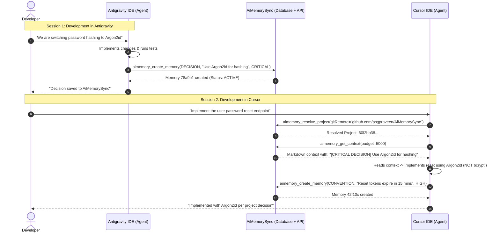

# Cursor IDE Integration Architecture Specification

> **Project**: AiMemorySync  
> **Phase**: Phase 6A (Architecture & Specification Only)  
> **Author & Lead Architect**: PSG Praveen ([@psgpraveen](https://github.com/psgpraveen))  
> **Document Status**: Complete & Authoritative  
> **Target Release**: Phase 6 (Extended Platform Rollout)  

---

## 1. Executive Summary

**AiMemorySync** is a secure, scalable, tenant-isolated shared AI memory and agent interoperability platform. Following the successful completion of Phase 5C.3 (VS Code extension release engine, automated CI/CD quality gates, and workspace onboarding), the platform actively maintains continuous memory synchronization across:
* **The Web Application**: Next.js 16 (Pure White & Radiant Ambient Mesh UI, App Router)
* **The Core REST API**: Authenticated Bearer token endpoints with scope authorization and rate limiting
* **The Client Core SDK**: `@aimemory/client-core` (isomorphic, zero runtime dependencies)
* **The Universal MCP Server**: `@aimemory/mcp-server` (Model Context Protocol over stdio)
* **The Antigravity Native Plugin**: `.agents/plugins/aimemory/`
* **The VS Code Extension**: `aimemory-vscode` (OS SecretStorage, status bar, tree views)

The goal of **Phase 6** is to introduce **Cursor IDE** into this unified ecosystem as a first-class participant. Cursor must participate in the exact same shared memory pool without creating a separate database, independent memory engine, or duplicate synchronization pipelines.

```text
                 ┌───────────────────────────┐
                 │          ChatGPT          │
                 │   (Browser / Extension)   │
                 └─────────────┬─────────────┘
                               │
                 ┌─────────────▼─────────────┐
                 │       AiMemorySync        │
                 │   Shared AI Memory Hub    │
                 └─────────────┬─────────────┘
                               │
          ┌────────────────────┼────────────────────┐
          ▼                    ▼                    ▼
   Antigravity IDE         Cursor IDE        VS Code Extension
 (Native MCP Plugin)      (Native MCP)     (VSIX + SecretStorage)
          │                    │                    │
          └────────────────────┼────────────────────┘
                               ▼
                   Canonical Database Layer
                   (Supabase PostgreSQL)
```

---

## 2. Current AiMemorySync Architecture

The existing production architecture is structured strictly around clean separation of concerns and the Adapter Design Pattern:

```text
┌────────────────────────────────────────────────────────────────────────┐
│                        PLATFORM CLIENT LAYER                           │
│                                                                        │
│   ┌─────────────────────┐   ┌──────────────────┐   ┌────────────────┐  │
│   │   Antigravity IDE   │   │    Cursor IDE    │   │    VS Code     │  │
│   │  (Native MCP Stdio) │   │   (MCP Target)   │   │  (Extension)   │  │
│   └──────────┬──────────┘   └────────┬─────────┘   └───────┬────────┘  │
└──────────────┼───────────────────────┼─────────────────────┼───────────┘
               │ stdio (JSON-RPC)      │ stdio (JSON-RPC)    │
               ▼                       ▼                     │
┌─────────────────────────────────────────────────────────┐  │
│         UNIVERSAL MCP SERVER (@aimemory/mcp-server)      │  │
│  • Stdio framing isolation (stdout: RPC, stderr: logs)  │  │
│  • Pre-flight anti-poisoning secret detection           │  │
│  • 8 AI Agent Tools & Dynamic Context Resource          │  │
│  • Session-scoped project resolution cache              │  │
└────────────────────────────┬────────────────────────────┘  │
                             │ Internal In-Memory SDK        │
                             ▼                               │
┌─────────────────────────────────────────────────────────┐  │
│          CLIENT CORE SDK (@aimemory/client-core)        │  │
│  • Dual ESM/CJS, zero runtime dependencies              │  │
│  • Exponential backoff + jitter HTTP transport          │  │
│  • Typed event emitter & in-memory TTL cache            │  │
└────────────────────────────┬────────────────────────────┘  │
                             │ HTTPS Bearer REST             │ HTTPS
                             ▼                               ▼
┌────────────────────────────────────────────────────────────────────────┐
│                     AIMEMORYSYNC REST API LAYER                        │
│  • Route Guards (requireAuth: 'read' | 'write' | 'admin')              │
│  • In-Memory Sliding-Window Rate Limiter                               │
│  • Endpoints: /api/auth/*, /api/projects/*, /api/memories/*           │
└────────────────────────────┬───────────────────────────────────────────┘
                             │
                             ▼
┌────────────────────────────────────────────────────────────────────────┐
│                     DOMAIN SERVICE LAYER                               │
│  • auth.service.ts      • project.service.ts                           │
│  • memory.service.ts    • context.service.ts                           │
│  • identity.service.ts (4-Tier Confidence Resolution)                  │
└────────────────────────────┬───────────────────────────────────────────┘
                             │
                             ▼
┌────────────────────────────────────────────────────────────────────────┐
│                  DATABASE & PERSISTENCE (Prisma ORM)                   │
│  • Models: Project, Memory, ProjectIdentity, ProjectSource, ApiKey     │
│  • Storage: Hosted PostgreSQL (Supabase)                               │
└────────────────────────────────────────────────────────────────────────┘
```

---

## 3. Cursor Integration Architecture

### 3.1 Core Design Principle
**Cursor does NOT receive a separate memory implementation, database, or duplicate domain services.**

The canonical source of truth remains the central AiMemorySync PostgreSQL database. Cursor interfaces with the platform solely through the existing:
1. **Universal MCP Server** (`@aimemory/mcp-server`)
2. **Client Core SDK** (`@aimemory/client-core`)
3. **Core REST API** (`POST /api/projects/resolve`, `GET /api/projects/:id/context`, etc.)

### 3.2 Cursor Capability Introspection & Verification Matrix

To ensure our design reflects actual software capabilities rather than assumptions:

| Capability Area | Cursor Verified Support | AiMemorySync Mapping | Confidence / Evidence |
| :--- | :--- | :--- | :--- |
| **Model Context Protocol (MCP)** | Native support via `.cursor/mcp.json` and Global Cursor Settings | Launches `@aimemory/mcp-server` over stdio | **Verified**: Cursor natively implements MCP client specifications. |
| **Autonomous Tool Calling** | Cursor Composer (Agent mode) executes tools autonomously | Composer invokes `aimemory_resolve_project`, `aimemory_get_context`, etc. | **Verified**: Agent mode invokes declared tools to fulfill tasks. |
| **Resource & Context Mentions** | `@` symbol indexing in Chat and Composer | Dynamic resource `aimemory://projects/{id}/context` | **Verified**: Cursor indexes MCP resources for manual attachment. |
| **Project Rules System** | Modern `.cursor/rules/*.mdc` (frontmatter) and legacy `.cursorrules` | `.cursor/rules/aimemory.mdc` | **Verified**: Modern `.mdc` format supports `globs` and `alwaysApply`. |
| **VS Code Extension Engine** | Forks VS Code Extension API | Optional companion install of `aimemory-vscode` | **Verified**: Cursor installs `.vsix` packages cleanly. |

---

## 4. Cursor MCP Flow

Cursor communicates with `@aimemory/mcp-server` as a native child process over `stdio`.

```text
Cursor IDE (Host)
   │
   │ 1. Spawns child process via node / npx
   ▼
@aimemory/mcp-server (Local Process)
   │
   │ 2. Handshake: initialize & list_tools
   ▼
Cursor Composer / Agent (Tool Discovery)
   │
   │ 3. Tool Call: aimemory_resolve_project(gitRemote, manifest)
   ▼
@aimemory/mcp-server
   │
   │ 4. Invokes @aimemory/client-core HTTP transport
   ▼
AiMemorySync REST API (POST /api/projects/resolve)
   │
   │ 5. Normalizes signals -> 4-tier match -> Returns Project UUID
   ▼
Cursor Agent
   │
   │ 6. Tool Call: aimemory_get_context(budget: 5000)
   ▼
AiMemorySync REST API (GET /api/projects/:id/context)
   │
   │ 7. Returns Markdown formatted with Decision / Convention / Bug headers
   ▼
Cursor Prompt Injection (AI Agent works within verified rules)
```

### 4.1 MCP Server Configuration (`.cursor/mcp.json`)
Cursor expects MCP server definitions in `.cursor/mcp.json` located at the root of the workspace:

```json
{
  "mcpServers": {
    "aimemory": {
      "command": "node",
      "args": [
        "node_modules/@aimemory/mcp-server/dist/index.js"
      ],
      "env": {
        "AIMEMORY_API_URL": "http://localhost:3000",
        "AIMEMORY_API_KEY": "aimem_live_your_scoped_api_key"
      }
    }
  }
}
```

---

## 5. Authentication

Authentication strictly reuses the platform's established **Bearer API Key** infrastructure (`ApiKey` table, SHA-256 hash storage at rest, scope authorization).

### 5.1 Credential Placement & Storage Strategy
Under no circumstances should plaintext secrets be committed to version control.

1. **Workspace Scope (Safe Template Pattern)**:
   - Provide `.cursor/mcp.example.json` with placeholders:
     ```json
     {
       "mcpServers": {
         "aimemory": {
           "command": "npx",
           "args": ["-y", "@aimemory/mcp-server"],
           "env": {
             "AIMEMORY_API_URL": "http://localhost:3000",
             "AIMEMORY_API_KEY": "PASTE_YOUR_API_KEY_HERE"
           }
         }
       }
     }
     ```
   - Ensure `.cursor/mcp.json` is added to the project `.gitignore`.
2. **Global User Scope (Recommended for Production)**:
   - Configure the MCP server inside Cursor's global configuration (`~/.cursor/mcp.json` or **Cursor Settings > Features > MCP**).
   - This keeps credentials completely outside the repository tree across all projects.
3. **Scope Requirements**:
   - The key must possess `read` and `write` scopes (admin scope is not required for Cursor).

---

## 6. Project Resolution

When Cursor opens a workspace, it must map to the exact same project UUID as Antigravity and VS Code without manual configuration.

### 6.1 Workspace Signal Extraction
The Cursor Agent (guided by `.cursor/rules/aimemory.mdc`) invokes `aimemory_resolve_project`:

```json
{
  "workspaceName": "AiMemorySync",
  "gitRemoteUrl": "https://github.com/psgpraveen/AiMemorySync.git",
  "packageManifest": {
    "name": "aimemorysync",
    "ecosystem": "npm"
  }
}
```

### 6.2 Deterministic Multi-Tier Resolution Engine
The backend resolves the project via `identity.service.ts`:
1. **Tier 1 (Canonical Git Remote)**: Normalizes HTTPS and SSH variants (`git@github.com:...` &rarr; `github.com/...`), strips authentication and trailing `.git`, computes SHA-256 hash. Matches `ProjectIdentity(type=GIT_REMOTE)`.
2. **Tier 2 (Monorepo Subproject)**: Matches Git remote hash + subproject relative path.
3. **Tier 3 (Package Manifest)**: Matches `ProjectIdentity(type=PACKAGE_MANIFEST)`.
4. **Tier 4 (Workspace Digest Fallback)**: Hashes workspace name + root directory signatures.

**Guaranteed Result**: Whether a developer opens the repository in Cursor on macOS or Antigravity on Windows, both agents resolve to the identical `project.id` (e.g., `60f2bb38-250c-4cb1-b934-1c826873e371`).

---

## 7. Context Injection

Context injection in Cursor operates via a dual dynamic-static strategy:

### 7.1 Static Context: Project Instructions & Guardrails (`.cursor/rules/aimemory.mdc`)
Static instructions belong in the repository to instruct the model *how* and *when* to interact with AiMemorySync. They do **not** duplicate dynamic memory contents:

```markdown
---
description: AiMemorySync shared persistent AI memory and cross-platform synchronization protocol.
globs: ["**/*"]
alwaysApply: true
---

# AiMemorySync — Cursor Agent Protocol

You are connected to **AiMemorySync**, a universal cross-platform AI memory platform shared across Cursor, Antigravity, and VS Code.

## 1. Context Retrieval Lifecycle
- **When to Retrieve**: Retrieve project context when beginning a new substantial task, exploring codebase architecture, or answering questions regarding architectural decisions.
- **Do NOT Retrieve**: Do not call context tools before trivial single-line edits or localized syntax fixes.
- **Procedure**:
  1. Call `aimemory_resolve_project` using the workspace name and Git remote.
  2. Call `aimemory_get_context` with a budget of 5000–8000 characters.
  3. Adhere strictly to priorities: `CRITICAL` (architectural/security constraints) > `HIGH` (project conventions) > `NORMAL` > `LOW`.

## 2. Memory Capture Protocol
When you establish a verified architectural decision, discover a non-obvious bug solution, or confirm a project convention:
1. Ensure the implementation is verified and working.
2. Verify that no secrets, tokens, passwords, or local drive paths are present.
3. Call `aimemory_create_memory` with appropriate type (`DECISION`, `CONVENTION`, `REQUIREMENT`, `BUG_SOLUTION`) and priority.
```

### 7.2 Dynamic Context: Token-Bounded Memory Delivery
Dynamic context is synthesized on-demand via `aimemory_get_context`:
* Uses the knapsack packing algorithm in `context.service.ts`.
* Orders memories strictly: `CRITICAL` &rarr; `HIGH` &rarr; `NORMAL` &rarr; `LOW`, then `updatedAt DESC`.
* Excludes deprecated and archived records.
* Generates pure Markdown with structured section headers.

---

## 8. Memory Read Flow

```text
Cursor Composer / Chat
         │
         │ 1. Invokes tool: aimemory_get_context(budget: 5000)
         ▼
@aimemory/mcp-server
         │
         │ 2. Extracts cached active projectId from McpSessionManager
         ▼
@aimemory/client-core
         │
         │ 3. Executes GET /api/projects/:id/context?budget=5000
         ▼
AiMemorySync API (auth-guard: verifies 'read' scope)
         │
         │ 4. context.service.ts queries Prisma: Memory.findMany(status=ACTIVE)
         ▼
Context Packing Algorithm (PRIORITY_WEIGHT ordering + character cap)
         │
         │ 5. Returns Markdown envelope { data: { markdown, budget, metadata } }
         ▼
Cursor Prompt Window (Injected seamlessly as verified system context)
```

---

## 9. Memory Write Flow

```text
Cursor Composer
         │
         │ 1. Invokes tool: aimemory_create_memory(type, title, content, priority)
         ▼
@aimemory/mcp-server (Pre-Flight Anti-Poisoning Gate)
         │
         │ 2. Regex scan: detects aimem_live_*, Bearer, AWS, GitHub tokens
         │    [If secret detected: ABORTS with Security Violation Error]
         ▼
@aimemory/client-core
         │
         │ 3. Executes POST /api/projects/:id/memories (Bearer token)
         ▼
AiMemorySync API (auth-guard: verifies 'write' scope)
         │
         │ 4. memory.service.ts:
         │    - Normalizes title & content (lowercased, trimmed whitespace)
         │    - Generates deterministic SHA-256 contentHash
         │    - Checks duplicate within project (contentHash match)
         │    [If duplicate: returns 409 ConflictError]
         ▼
Prisma ORM -> PostgreSQL (Inserts record into `memories` table)
         │
         │ 5. Returns created memory metadata
         ▼
Cursor Composer (Notifies developer: "Memory stored successfully")
```

---

## 10. Antigravity ↔ Cursor Shared Memory

There is **no direct peer-to-peer connection** between Antigravity and Cursor. The central AiMemorySync database serves as the canonical shared memory broker.



---

## 11. Tenant Isolation Architecture

While current development operates on a single-tenant database model, the system is architected to seamlessly accommodate multi-tenancy:

1. **Tenant Boundaries**:
   - Every API key will be strictly bound to a `tenantId`.
   - All Project and Memory queries will enforce `where: { tenantId, ... }`.
2. **Cursor Isolation**:
   - The Cursor client will only access projects and memories belonging to the tenant owning the supplied `AIMEMORY_API_KEY`.
   - Cross-tenant queries are blocked at the route guard level (403 Forbidden).
3. **Integrity Rule**: No premature mock tenant code will be added until the multi-tenant migration phase is formally initiated.

---

## 12. Security Threat Model

| Threat / Attack Vector | Severity | Mitigation Strategy |
| :--- | :--- | :--- |
| **1. API Key Leakage in Repo** | High | `.cursor/mcp.json` added to `.gitignore`; provide `.cursor/mcp.example.json`; support global Cursor settings. |
| **2. Memory Poisoning (Injecting False Rules)** | High | Pre-flight regex secret scanner in MCP server; deterministic deduplication; route guard scope checks; developer visibility. |
| **3. Prompt Injection via Memory Content** | High | Sanitized Markdown rendering in `context.service.ts`; no raw executable scripts; context structured under clear semantic boundaries. |
| **4. Cross-Project Data Bleed** | High | Strict UUID scoping in all route paths (`/api/projects/:id/memories`); route parameters override body payload; project existence validation. |
| **5. Accidental Secret Persistence** | High | MCP server regex detector blocks live keys, test keys, Bearer tokens, and standard cloud credential formats before dispatch. |
| **6. Stdio Framing Corruption** | Medium | MCP server reserves `stdout` 100% for JSON-RPC; internal logger directs all diagnostic output exclusively to `stderr`. |
| **7. Local Path Privacy Leakage** | Medium | Normalizers and MCP tools reject absolute drive paths (`C:\...`, `/home/...`) transmitting only relative subpaths or project names. |
| **8. Compromised Developer Key** | High | One-click instant key revocation via Web UI (`/settings/api-keys`) and database flag (`revokedAt = new Date()`). |
| **9. Rate Limit Exhaustion / DoS** | Medium | In-memory sliding-window rate limiter throttles burst requests with 429 Too Many Requests and `Retry-After` headers. |
| **10. Tampering with Rules File** | Low | Cursor rule file (`.cursor/rules/aimemory.mdc`) is version-controlled and subject to standard git pull request reviews. |

---

## 13. Failure Modes & Graceful Degradation

| Failure Mode | System Response | AI Agent Behavior |
| :--- | :--- | :--- |
| **AiMemorySync Backend Offline** | `client-core` throws `NetworkError` after retries. | Agent emits warning: *"AiMemorySync unreachable; proceeding with local repository context only."* **Zero hallucinated memory.** |
| **Invalid / Revoked API Key** | Route returns `401 Unauthorized`. | Tool returns error message. Agent alerts developer: *"API key invalid or revoked. Check Cursor MCP configuration."* |
| **Project Not Found** | Resolution returns 404 or creates new fallback project. | Agent works safely within the newly resolved project scope. |
| **Duplicate Memory Submission** | API returns `409 ConflictError`. | Tool catches conflict gracefully: *"Duplicate memory already exists; skipping redundant persistence."* |
| **Database Unavailable / Paused** | API returns safe `500 Internal Error`. | Tool alerts agent of server outage; operations fail safely without data corruption. |
| **Malformed Tool Payload** | Zod input schema validation fails (400). | Tool returns validation error details; agent corrects arguments. |

---

## 14. Proposed Repository File Structure

### Existing Files (Reused Unchanged)
```text
packages/mcp-server/
├── src/
│   ├── index.ts                   [EXISTING - Stdio entry point]
│   ├── server.ts                  [EXISTING - Tool & resource registration]
│   ├── session.ts                 [EXISTING - Session project cache]
│   ├── security/logger.ts         [EXISTING - Stderr logger & pattern scrubber]
│   └── tools/                     [EXISTING - 8 Universal AI tools]
packages/client-core/              [EXISTING - Reusable HTTP & domain SDK]
packages/vscode-extension/         [EXISTING - Companion visual UI]
src/lib/integrations/              [EXISTING - Integration definitions registry]
```

### Proposed Files (To Be Created in Phase 6B & 6C)
```text
.cursor/
├── mcp.example.json               [PROPOSED - Zero-credential template for developers]
└── rules/
    └── aimemory.mdc               [PROPOSED - Cursor rule specification with frontmatter]

src/
├── app/
│   └── integrations/
│       └── cursor/
│           └── setup/
│               └── page.tsx       [PROPOSED - 6-Step guided Cursor onboarding wizard]
├── lib/
│   └── integrations/
│       └── providers/
│           └── cursor.ts          [PROPOSED - Update from 'coming_soon' to 'available']

docs/
├── CURSOR_INTEGRATION_ARCHITECTURE.md [PROPOSED - This authoritative document]
└── CURSOR_INTEGRATION_GUIDE.md        [PROPOSED - Developer walkthrough and manual]
```

---

## 15. Phase 6 Implementation Roadmap

```text
Phase 6A: Architecture Specification (COMPLETE)
   │
   ▼
Phase 6B: Integration Registry & Web Onboarding Wizard
   • Update src/lib/integrations/providers/cursor.ts to 'available'
   • Build /integrations/cursor/setup wizard
   • Add Cursor zero-credential ZIP package generator
   │
   ▼
Phase 6C: Cursor Rules & Workspace Configuration Templates
   • Implement .cursor/mcp.example.json
   • Implement .cursor/rules/aimemory.mdc
   • Automated tests verifying Cursor configuration schemas
   │
   ▼
Phase 6D: Cross-Platform Continuity Verification Suite
   • E2E test: Antigravity creates memory -> Cursor MCP reads context
   • E2E test: Cursor MCP creates memory -> Antigravity retrieves context
   │
   ▼
Phase 6E: Production Hardening, Documentation & Release
   • Comprehensive user manual in docs/CURSOR_INTEGRATION_GUIDE.md
   • Quality gates: typecheck, lint, monorepo test:all
   • Git commit on main
```

---

## 16. Open Questions & Resolutions

* **Q1: Should Cursor use a custom extension or native MCP?**
  * **Resolution**: Native MCP is the primary engine because it integrates directly with Cursor Composer and Chat. The VS Code extension serves as an optional visual companion.
* **Q2: Does Cursor support `.cursor/rules/*.mdc`?**
  * **Resolution**: Yes. Modern versions of Cursor use the `.mdc` format with YAML frontmatter (`alwaysApply: true`), superseding legacy `.cursorrules`.
* **Q3: How should API keys be managed for open-source repos?**
  * **Resolution**: `.cursor/mcp.json` must be git-ignored. Developers should use global Cursor settings (`~/.cursor/mcp.json`) or local `.cursor/mcp.json` derived from `mcp.example.json`.

---

## 17. Risks & Mitigations

1. **Risk**: Developer commits `.cursor/mcp.json` containing an active API key to a public Git repository.  
   **Mitigation**: Include `.cursor/mcp.json` in root `.gitignore`. Distribute only `.cursor/mcp.example.json` with clear placeholders.
2. **Risk**: Agent floods the API with context requests on every small keystroke.  
   **Mitigation**: Enforce rule guidelines in `.cursor/rules/aimemory.mdc` prohibiting context calls on trivial edits; rate-limit requests on the backend.
3. **Risk**: Cursor updates its MCP implementation syntax.  
   **Mitigation**: Follow strict Model Context Protocol standard specifications (`@modelcontextprotocol/sdk`).

---

## 18. Verification Plan

Because Phase 6A is **Architecture & Specification Only**, verification consists of:
1. **Existing Architecture Integrity**: Confirm zero modifications were made to existing production services, Prisma schema, or Next.js routes.
2. **Monorepo Quality Gates**:
   - `npm run typecheck:all`: 0 errors
   - `npm run lint`: 0 errors
   - `npm run test:all`: 71/71 tests passing
3. **Specification Completeness**: Confirm all 18 required sections of `docs/CURSOR_INTEGRATION_ARCHITECTURE.md` are fully drafted and synchronized with project memory.
